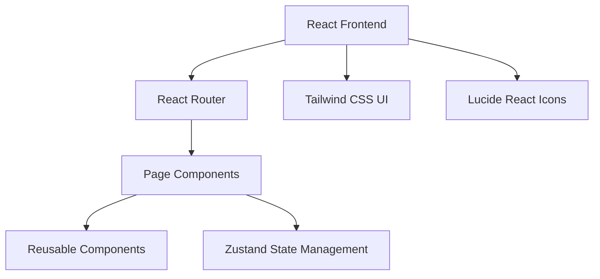
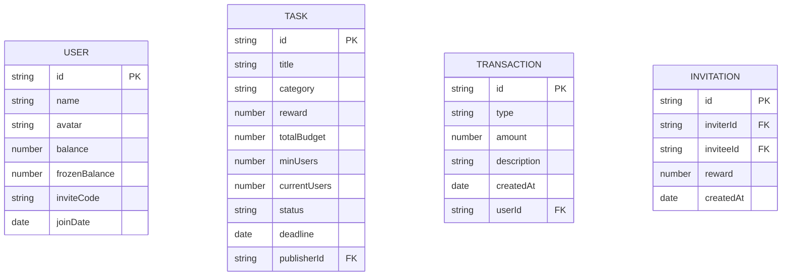

## 1. Architecture Design


## 2. Technology Description
- **Frontend**: React@18 + TypeScript + Tailwind CSS@3 + Vite
- **Initialization Tool**: vite-init
- **State Management**: Zustand
- **Routing**: React Router DOM
- **Icons**: Lucide React
- **Backend**: None (纯前端演示)
- **Database**: 本地模拟数据

## 3. Route Definitions
| Route | Purpose |
|-------|---------|
| / | 任务广场页 |
| /invite | 好友邀约页 |
| /publish | 发布管理页 |
| /profile | 个人中心页 |
| /wallet | 现金钱包页 |
| /create-task | 创建任务页 |
| /recharge | 充值页面 |
| /withdraw | 提现页面 |

## 4. Data Model
### 4.1 Data Model Definition


### 4.2 Mock Data Structure
```typescript
// 用户数据类型
interface User {
  id: string;
  name: string;
  avatar: string;
  balance: number;
  frozenBalance: number;
  inviteCode: string;
  joinDate: string;
}

// 任务数据类型
interface Task {
  id: string;
  title: string;
  category: string;
  reward: number;
  totalBudget: number;
  minUsers: number;
  currentUsers: number;
  status: 'active' | 'pending' | 'paused' | 'ended' | 'removed';
  deadline: string;
  publisherId: string;
}

// 交易记录类型
interface Transaction {
  id: string;
  type: 'income' | 'expense';
  amount: number;
  description: string;
  createdAt: string;
}

// 邀请记录类型
interface Invitation {
  id: string;
  inviterId: string;
  inviteeId: string;
  reward: number;
  createdAt: string;
}
```

## 5. File Structure
```
/workspace
├── src/
│   ├── components/          # 可复用组件
│   │   ├── BottomNav.tsx   # 底部导航栏
│   │   ├── GlassCard.tsx   # 磨砂玻璃卡片
│   │   ├── TaskCard.tsx    # 任务卡片
│   │   └── Button.tsx      # 按钮组件
│   ├── pages/              # 页面组件
│   │   ├── TaskSquare.tsx  # 任务广场页
│   │   ├── Invite.tsx      # 好友邀约页
│   │   ├── PublishManage.tsx # 发布管理页
│   │   ├── Profile.tsx     # 个人中心页
│   │   ├── Wallet.tsx      # 现金钱包页
│   │   └── CreateTask.tsx  # 创建任务页
│   ├── hooks/              # 自定义 Hooks
│   │   └── useStore.ts     # Zustand 状态管理
│   ├── utils/              # 工具函数
│   │   └── format.ts       # 格式化工具
│   ├── App.tsx             # 根组件
│   ├── main.tsx            # 入口文件
│   └── index.css           # 全局样式
├── .trae/documents/        # 文档目录
├── package.json
├── tsconfig.json
├── vite.config.ts
├── tailwind.config.js
└── postcss.config.js
```

## 6. Core Component Design
### 6.1 BottomNav Component
- 4栏固定Tab导航
- 线性图标 + 文字标签
- 选中态冰蓝渐变填充 + 外发光
- 磨砂玻璃半透底色

### 6.2 GlassCard Component
- 磨砂玻璃质感
- 1px冰蓝霓虹描边
- 弥散柔和阴影
- 可配置圆角尺寸

### 6.3 State Management (Zustand)
```typescript
interface AppState {
  currentTab: number;
  user: User | null;
  tasks: Task[];
  transactions: Transaction[];
  setCurrentTab: (tab: number) => void;
  setUser: (user: User) => void;
  addTask: (task: Task) => void;
  addTransaction: (transaction: Transaction) => void;
}
```
