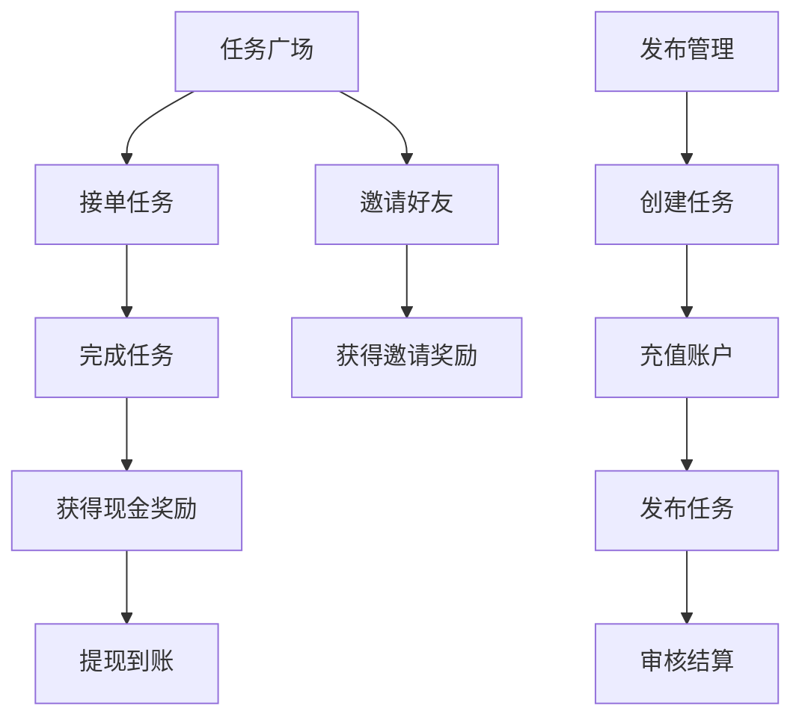

## 1. Product Overview
专业的安卓众包任务平台APP，为用户提供接单赚钱和商家发布任务的完整生态
- 解决传统网赚平台虚拟货币复杂、设计廉价的问题，提供全现金计价的高端商务体验
- 目标用户为安卓用户、兼职赚钱用户和需要发布任务的商家

## 2. Core Features

### 2.1 User Roles
| Role | Registration Method | Core Permissions |
|------|---------------------|------------------|
| 普通用户 | 手机号注册 | 浏览任务、接单、完成任务、获取现金奖励、邀请好友 |
| 商家用户 | 手机号注册 | 发布任务、管理任务、充值提现、查看数据 |

### 2.2 Feature Module
1. **任务广场页**: 任务浏览、分类筛选、任务卡片、签到福利
2. **好友邀约页**: 邀请好友、收益展示、邀请流程、活动规则
3. **发布管理页**: 任务管理、状态筛选、创建任务、资金管理
4. **个人中心页**: 用户信息、工作台、资金账单、系统设置
5. **现金钱包页**: 资产展示、充值提现、收支流水
6. **创建任务页**: 任务表单、步骤编辑、预览提交

### 2.3 Page Details
| Page Name | Module Name | Feature description |
|-----------|-------------|---------------------|
| 任务广场页 | 顶部导航栏 | APP Logo、搜索框、福利铃铛 |
| 任务广场页 | 现金资产条 | 展示钱包余额、打开钱包按钮 |
| 任务广场页 | 分类筛选栏 | 可滑动分类标签、选中高亮 |
| 任务广场页 | 任务列表 | 瀑布流卡片、赏金金额、任务信息 |
| 任务广场页 | 签到福利弹窗 | 日历式签到、成长值、奖励展示 |
| 好友邀约页 | Banner区域 | 邀请主题、核心收益文案 |
| 好友邀约页 | 邀请数据卡片 | 邀请人数、待发现金、累计到账 |
| 好友邀约页 | 邀请流程 | 三步流程卡片展示 |
| 好友邀约页 | 活动规则 | 折叠面板、规则说明 |
| 发布管理页 | 顶部导航 | 页面标题、充值按钮 |
| 发布管理页 | 资金卡片 | 发单账户余额、任务统计 |
| 发布管理页 | 状态筛选Tab | 任务状态切换 |
| 发布管理页 | 任务列表 | 已发布任务卡片、操作按钮 |
| 发布管理页 | 创建任务按钮 | 大按钮引导创建 |
| 个人中心页 | 用户头部 | 头像、账号信息、钱包入口 |
| 个人中心页 | 总资产卡片 | 钱包总资产展示 |
| 个人中心页 | 工作台 | 参与的任务、发布的任务 |
| 个人中心页 | 资金账单 | 收支明细入口 |
| 个人中心页 | 系统设置 | 账号安全、通知、客服等 |
| 现金钱包页 | 总资产卡片 | 可用余额、冻结金额 |
| 现金钱包页 | 操作按钮 | 充值、提现按钮 |
| 现金钱包页 | 流水筛选 | 分类筛选Tab |
| 现金钱包页 | 流水列表 | 收支记录展示 |
| 创建任务页 | 表单分组 | 基础信息、赏金规则、审核规则、任务步骤 |
| 创建任务页 | 底部操作栏 | 预览、提交按钮 |

## 3. Core Process
用户浏览任务广场 → 选择感兴趣任务 → 接单完成 → 获得现金奖励 → 邀请好友获得额外收益
商家充值账户 → 创建发布任务 → 管理审核任务 → 结算提现

## 4. User Interface Design
### 4.1 Design Style
- **主品牌色**: 深海科技蓝 #0F56E8
- **渐变组合**: 冰霓虹蓝 #36B0FF → 深海蓝 #0939A8
- **现金金额色**: 荧光哑光鎏金 #FFD266
- **按钮风格**: 胶囊圆角、磨砂玻璃、微弱冰蓝外发光
- **字体**: 安卓思源黑体，金额数字等宽加粗
- **布局风格**: 卡片式分层悬浮、左对齐规整排版
- **光影**: 弥散柔和阴影、霓虹描边、卡片分层立体感

### 4.2 Page Design Overview
| Page Name | Module Name | UI Elements |
|-----------|-------------|-------------|
| 任务广场页 | 整体布局 | 磨砂玻璃质感、深海蓝主调、鎏金金额高亮 |
| 任务广场页 | 底部导航 | 4栏固定Tab、线性图标、选中冰蓝渐变发光 |
| 好友邀约页 | Banner | 全屏磨砂渐变、顶部冰蓝光晕 |
| 发布管理页 | 资金卡片 | 1px冰蓝霓虹描边、悬浮柔光阴影 |
| 创建任务页 | 表单 | 分组磨砂玻璃卡片、科技感下拉弹窗 |
| 现金钱包页 | 总资产 | 超大鎏金发光数字、渐变玻璃卡片 |

### 4.3 Responsiveness
- 安卓竖屏 9:19.5 2K超清界面
- 8dp基础栅格，左右安全边距20dp
- Material Design 3 轻量化科技组件规范
- 适配所有安卓分辨率

### 4.4 交互动效
- Tab切换：图标渐变填充平滑过渡、外发光同步亮起
- 金额加载：数字滚动动画、鎏金发光缓慢亮起
- 卡片悬浮：视差上浮、霓虹描边呼吸发光
- 按钮交互：按压缩小、外发光增强
